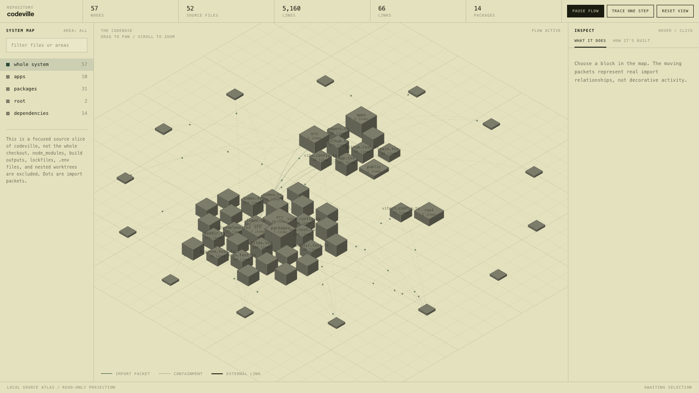

<!-- repo.meta
  owner: yanitedhacker
  repo: codeville
  clone: https://github.com/yanitedhacker/codeville.git
-->

<h1 align="center">
  
</h1>

<p align="center">
  <strong>Drop a repo. Get a city.</strong>
</p>

<p align="center">
  <a href="https://github.com/yanitedhacker/codeville/actions/workflows/ci.yml"></a>
  <a href="LICENSE"></a>
  <a href="package.json"></a>
</p>

<p align="center">
  <a href="docs/architecture.md">Architecture</a> ·
  <a href="SECURITY.md">Security</a> ·
  <a href="CONTRIBUTING.md">Contributing</a>
</p>

Point it at a repository. It emits an interactive isometric atlas as one HTML file. Supported source files become blocks; parser-confirmed and heuristic imports become inspectable arcs. The atlas reports unsupported files, unresolved imports, and roll-ups instead of hiding them. Click a block to inspect its role, source excerpt, symbols, and relationships. Pan the map.

You cannot hold a 400-file tree in your head. A map you can pan is the point. If you want to *see* a codebase instead of grep it, this is it.

The guided tour, dependency focus/cones, directed paths, and `Trace one step` are based on visible static import topology. They are not runtime instrumentation, runtime traces, or execution-flow analysis.

## Features

- Map controls include City and Dependencies projections, drag or arrow-key panning, scroll or `+`/`-` zoom, `0` reset, flow pause/resume, and Reset view. `Trace one step` advances each displayed import packet once; it does not step program execution.
- Search ranks visible nodes by file path, node label, role, or symbol. The coverage panel reports exact, heuristic, unsupported, unresolved, rolled-up, and hidden-external counts when coverage data is available.
- Select a node and focus its dependencies or dependents to inspect a topology-derived cone. Select two nodes with Shift-click and use Find directed path to show a shortest directed path in the visible slice.
- The guided tour walks the visible areas, dependency hubs, external boundary, and whole system. It is derived from the same static atlas data.
- Select an arc to inspect its endpoints, extraction confidence, source locations, and sample import statements.
- Runtime Lens imports local OpenTelemetry Protocol (OTLP) `.json` or `.jsonl` trace data. It shows observed spans in a separate timeline, call tree, hot path, error paths, details panel, and exact source-file handoff. It does not change the static atlas or `Trace one step` evidence.
- The browser can export the current atlas as one standalone HTML file. The downloaded file inlines the atlas, JavaScript, and CSS and makes no network requests when opened offline.

Folders and zip archives are read in the browser. The GitHub input route fetches the archive through the server; after analysis, the exported HTML is self-contained.

<p align="center">
  
</p>

## Quick start

```bash
git clone https://github.com/yanitedhacker/codeville.git
cd codeville
pnpm install
pnpm -F @codeville/atlas-ui build
pnpm dev
```

Then drop a folder on http://localhost:5273, drop a `.zip`, or paste `owner/repo`.

CLI:

```bash
pnpm atlas . -o atlas.html
pnpm atlas . -o atlas.json
pnpm atlas . -o atlas.html --report atlas.md
pnpm atlas . \
  --trace fixtures/runtime/minimal-otlp.json \
  --trace-source-root "$PWD" \
  -o codeville-runtime.html
pnpm atlas ask . --node packages/core/src/graph.ts --fn buildGraph \
  --question "What does this function contribute to the graph?"
open atlas.html
```

`-o` writes standalone HTML for `.html` paths or the atlas data as pretty-printed JSON for `.json` paths. The default is `<repo>-atlas.html`. The optional `--report` output is a facts-only Markdown snapshot of the visible slice; it contains no source excerpts or AI prose. HTML export requires the standalone bundle, built with `pnpm -F @codeville/atlas-ui build`.

`--trace` accepts a local OTLP `.json` object or `.jsonl` file. A JSON file contains one document. Each non-empty JSONL line is one document. Runtime trace import is available only for HTML output. `--trace` with `.json` Atlas output is rejected. `--trace-source-root` is optional and supplies the source root that was recorded in `code.file.path`; if you omit it in the CLI, Codeville uses the analyzed repository root. Markdown reports stay static-source reports and exclude runtime trace data.

In the browser, import a local `.json` or `.jsonl` trace after the static atlas exists. When runtime data exists, use `Export HTML (includes sanitized telemetry)` to write a self-contained HTML file with the normalized, sanitized runtime bundle. Raw OTLP input is not included.

`codeville ask <path-to-repo> --node <repo-relative-file> --fn <outline-symbol> --question <text>` prints an answer about a named symbol in its atlas context. The symbol must appear in that file's extracted outline. Pass `--atlas atlas.json` to reuse a generated JSON atlas instead of rebuilding it. The ask command does not execute code or collect runtime evidence.

Common generation options:

- `--max-nodes <n>` limits the visible node budget (default `220`, including packages); a file and its area slab may exceed the budget by one.
- `--exclude <paths>` drops comma-separated path prefixes.
- `--no-cache` bypasses the cache under `~/.cache/codeville`.
- `-j, --concurrency <n>` controls parallel explainer calls (default `4` for CLI adapters and `6` for API adapters).

## How it fits together

- Folder and zip never leave the browser.
- GitHub paste is the only server fetch (codeload), because that host has no CORS.
- CLI writes one HTML file. Open it from `file://`. Zero network.
- Runtime import is a separate local flow: OTLP JSON or JSONL is parsed, normalized, redacted, derived, and exactly correlated against visible source paths before Runtime Lens or offline HTML receives it. It does not add runtime facts to static import links.
- AI explainers are optional and only add a summary sentence. They never replace derived fields. CLI adapters use a binary you already signed into.

## Inspiration

Codeville draws inspiration from [inkboard/system-atlas](https://github.com/inkboard/system-atlas), including its isometric visual grammar, progressive-disclosure tours, and explorable system maps. Codeville uses its own repository analyzer, data model, renderer, CLI, and offline export pipeline.

## Exact versus heuristic extraction

Exact extraction is a Babel parse of `.ts`, `.tsx`, `.js`, `.jsx`, `.mjs`, `.cjs`, `.mts`, and `.cts`. A parse error falls back to the line scanner and marks that file heuristic.

Python, Go, Rust, Vue, Svelte, and Astro extraction is heuristic in v1. Other accepted source extensions are unsupported: they can still receive a block, but they contribute no import facts.

## Security defaults

Treat an analysed repo as untrusted input. Paths, excerpts, and import strings all land in the atlas.

The export HTML is offline. Do not load fonts or CDNs into it.

Folder and zip ingest are client-side. The GitHub route is capped: 90MB archive, gunzip output cap, `ref` cannot contain `..`.

`--explain claude` / `codex`: codeville does not see the credential.

`--explain openai` / `anthropic`: keys from the environment, never written into the atlas, the cache, or the logs.

Cache lives in `~/.cache/codeville`, never inside the target repo.

Runtime trace import is local and all-or-nothing. Codeville releases the raw input after import, keeps exact trace and span IDs, redacts configured sensitive attribute values, and exports only the normalized sanitized bundle. Runtime data is imported observation. It is not Codeville capture, field qualification, or a complete execution proof.

See [SECURITY.md](SECURITY.md).

## Explainers

The panel is full with no config. Role, fan-in, excerpt, packet samples: all derived. An adapter may add one `summary` sentence on top.

| `--explain` | Auth | Runs in |
| --- | --- | --- |
| `heuristic` | none | browser + node (default) |
| `codex` / `claude` / `cli:<cmd>` | a CLI you already signed into | node |
| `openai` / `anthropic` | `OPENAI_API_KEY` / `ANTHROPIC_API_KEY` | node |
| `module:<path>` | your file, your auth | node |

I strongly recommend you do not ask this project for "sign in with ChatGPT." That would mean impersonating the Codex client against a private endpoint. It is against OpenAI's terms and it breaks the week they rotate anything. Ride a subscription through `codex`, `claude`, or `cli:<cmd>`: your login, your binary. `module:<path>` is the slot if you want to own a different decision.

## Development

This is a pnpm workspace. `npm install` at the repository root is not supported.

```bash
pnpm install
pnpm test
pnpm typecheck
pnpm dev
```

CLI export still needs `pnpm -F @codeville/atlas-ui build`.

How the picture is built: [docs/architecture.md](docs/architecture.md). The standalone export aliases React to Preact; zip ingest uses fflate.

## Contributing

PRs welcome. See [CONTRIBUTING.md](CONTRIBUTING.md) and the [Code of Conduct](CODE_OF_CONDUCT.md).

[MIT](LICENSE).
